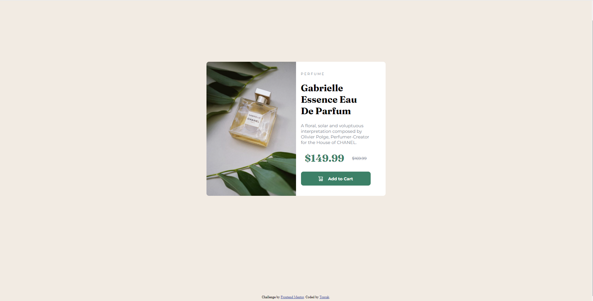
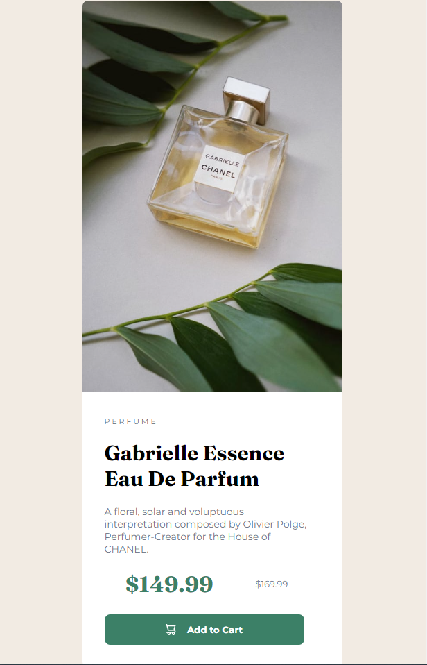

# Frontend Mentor - Product preview card component solution

This is a solution to the [Product preview card component challenge on Frontend Mentor](https://www.frontendmentor.io/challenges/product-preview-card-component-GO7UmttRfa). Frontend Mentor challenges help you improve your coding skills by building realistic projects. 

## Table of contents

- [Overview](#overview)
  - [The challenge](#the-challenge)
  - [Screenshot](#screenshot)
  - [Links](#links)
- [My process](#my-process)
  - [Built with](#built-with)
  - [What I learned](#what-i-learned)
  - [Continued development](#continued-development)
  - [Useful resources](#useful-resources)
- [Author](#author)


## Overview

### The challenge

Users should be able to:

- View the optimal layout depending on their device's screen size
- See hover and focus states for interactive elements

### Screenshot

Desktop-Laptop sized preview



Mobile sized preview




### Links

- Solution URL: [ Solution](https://toprakunal.github.io/Product-Preview/)
- Live Site URL: [ Live Site](https://toprakunal.github.io/Product-Preview/)

## My process

### Built with

- Semantic HTML5 markup
- CSS custom properties
- Flexbox
- Mobile-first workflow


### What I learned

I've learned mobile-first workflow, using media queries, min-max-width and most importantly CSS FlexBox. 

To see how you can add code snippets, see below:

```html
<main class="container">
```
I used main tag for best practice
```css
:root{
    --Dark-cyan: hsl(158, 36%, 37%);
    --cream: hsl(30, 38%, 92%);
    --Very-dark-blue: hsl(212, 21%, 14%);
    --Dark-grayish-blue: hsl(228, 12%, 48%);
    --White: hsl(0, 0%, 100%);
}
```
I've learned root selector for CSS
```css
.container{
    display: flex;
    align-items: center;
    justify-content: center;
    
    
}
```
I've tried to understand and work with CSS FlexBox


```css
@media (max-width: 650px) {
    .container{
        flex-direction: row;
    }

    .text-container{
        margin-left: 2rem;
    }

    .card{
        width: 18rem;
    }


    .image{
        float:none;
        border-top-left-radius: 0.5rem;
        border-top-right-radius: 0.5rem;
        border-bottom-left-radius: 0;
        width: 100%;
        
        
        
    }

    .button{
        margin-left: 0;
        width: 18rem;
    }
    
}
```
Media Queries is used for responsive design


### Continued development

I want to focus on more FlexBox, Media Quaries and responsive design for future projects. Maybe i consider work with BootStrap but first i want to feel confident with pure CSS and HTML


### Useful resources

- [CSS FlexBox](https://css-tricks.com/snippets/css/a-guide-to-flexbox/) - This helped me for quick FlexBox tips. I really liked this pattern and will use it going forward.
- [Media Queries](https://developer.mozilla.org/en-US/docs/Web/CSS/Media_Queries/Using_media_queries) - This is an amazing article which helped me finally understand Media Queries. I'd recommend it to anyone still learning this concept.


## Author

Toprak Ünal


